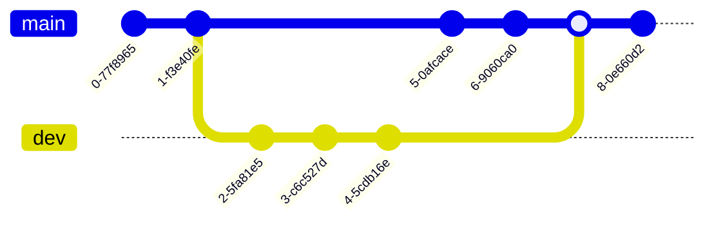

虽然我不太喜欢用基本概念做先导，但是......任何一个领域都有自己的行话，或称“黑话”；而后面的文章也无可避免地使用这些黑话。所以说，提前认识这些概念，对于接下来的学习应当会有所帮助。我也会尽力做到通俗易懂，没有废话。

但是，如果你只奔着实践而来，**希望通过实践来学习各种概念，那么请从第二章开始看**；等到遇见了自己不懂的词，再过来翻看一下，也是可以的。

> 不要试图在这篇文章里学习指令。
>
> 因为这篇文章的目的是理解概念，而非记忆指令。只有在特定的情境下去学习、记忆，才有学习的意义。
{ :.prompt-warning }

## TL;DR

- **Git 中最常见的概念（VCS、Repository、Branch、Commit、Pull、Push、......）**
- **Mermaid gitGraph**
- **使用 Git 前的准备工作**

## 基本概念总览

### Git 不等于 GitHub！

这是首先要提出的一个基本事实——很多人是先知道的 GitHub，然后才知道的 Git，甚至以为 Git 是属于 GitHub 的。

但**这是绝对错误的观点！！！千万不要这么去理解！！！**

因为**这混淆了“VCS”与“repository”的概念**。

#### VCS（*Version Control System*）

**VCS 是管理软件版本与代码内容的工具**。它的功能一般包括：

- 拉取最新代码/推送自己的代码；
- 查看不同版本间的差异，并选择有可能造成冲突的差异
- 查阅更改历史，甚至回溯到任意一次更改

例如 CVS（Concurrent Versions System）、SVN（Apache Subversion）、**Git**，等等。

#### repository（repo）

中文翻译是**“仓库”**，也就是**存放代码与更改记录的地方**。

代码可以存放在本地，只需要 `git init`，你就能在本地生成一个 repository。

要方便与其他人共同编写代码，可以将这个 Repository 上传到服务器，让服务器来托管。著名的托管平台包括 **GitHub** 和 GitLab；当然，你也可以不依赖它们，而是在自己的服务器上部署，最常见的部署方案包括 GitLab Application 和 Gitea。

### branch（分支）



**“分支”相当于一个“世界”（仓库）的不同“平行宇宙”**——其实就是不同的工作区。

“分支”记载了它自建立以来发生过的所有更改，其中每一次更改（图上的任意一个“节点”）都被叫做一个**“*commit*”（“提交”）**。“提交”一般由 40 位哈希值表示（SHA-1），不过一般只取前 7 位；

当然，你也可以在上面加**“*tag*”（标签）**为该 commit 命名，在标记版本号的情形下会很有用。

你可以在原来的分支中做修改，也可以从那个分支上“拉取”一条，然后再合并回去（在多人写作时，显然**后者才是推荐做法**，因为你至少需要保证有一条分支是稳定的，可以供其他人直接使用的）。

主分支一般叫做“main/master”，而其他分支的名称各有不同，例如开发分支“dev”、功能分支“feat”、Bug 修复分支“fix”、发布版本分支“release”。

#### 你在哪个 branch？

这是由**“头指针”（HEAD）**决定的。

正常情况下，头指针应当先指向某个 branch，然后才是这个分支的某一个 commit。

我们首先在新建的 repo 上添加一个文件，`a_text.txt`，然后查看 log。

```sh
$ git log
commit aba76ee36d372afebf5df00f4bc0ad011bb612ca (HEAD -> main)
Author: xxx
Date:   xxx

    a commit
```

`HEAD -> main` 的意思是，头指针目前就在 `main` 分支上。现在，它正指向该分支的 commit `aba76ee`。

`git status` 的结果显然更直观：

```sh
$ git status 
位于分支 main
无文件要提交，干净的工作区
```

#### checkout

***checkout*** 可用来调整头指针位置，也就是**更换到不同的 branch**。

但其中有一门“邪修”——将头指针指向某次 commit，而不是先指向 branch。这就有“悬垂头指针”的风险。

我们会在后面详细介绍“悬垂头指针”的方法、用途与危害。

#### branch 间的独立性

如果你**不做合并**，那么**所在分支上的任何修改不会影响到其他分支**。例如，你在“dev”上的修改不会影响到“release”。

你可以利用这一点修复 bug，或者添加一些新的功能，同时向外界保留可直接使用的发布版本分支。

#### merge

就是**将两个 branch 合并为一个**。

如果要将 bug 修复、新增功能合并到发布版分支，merge 必不可少。当然，merge 后如何解决冲突，也是个麻烦事......

#### rebase

也就是**“变基”**，将目前所在 branch 迁移到指定 branch 末尾，但仍然保持各自 branch 的独立性。

例如，目前的结构是


先 `git checkout fect`，再 `git rebase main`，就会变成这个样子：


rebase **不会覆盖掉 main 的 F 和 G，也不会让 fect 消失，只是让 fect 接在 main 的最后面**。

但这种行为属于**“让自己爽了，却让别人很抓狂”**——这里不做过多展开，留待后面的文章介绍这个问题。

### pull 与 push

如果你的 Git repo 位于服务器，那么经常地 ***pull* 与 *push*** 会是常态。

**pull 是拉取远程 repo 的最新 commit，而 push 是将你的 commit 推送至远程 repo。**

经常 pull 是一个好习惯，这可以确保你位于这条 branch 的最末端，在最大程度上避免冲突风险。

### conflict

对同一 commit 的同一处进行修改时，就会引发 ***conflict*（冲突）**。

conflict 可以发生在 pull、push、merge、rebase 之后；一旦发生了 conflict，你就要一个个地检查冲突发生的位置，然后选择接受的那个更改。

Git 的“三路合并”是解决 conflict 的一大特色。

### fork 与 push request（PR）

Git 是一种**分布式版本管理系统**，你可以从原始的代码仓库那里 ***fork*** 一个出来，做成自己的代码仓库。你 fork 出来的仓库仍然是一个独立的 repo！只不过你可以通过 ***push request*（PR）**，为“被 fork”的仓库做贡献。

### clone

就是将远程的 repo 下载到本地。

与 pull 不同，**clone 不需要你 init 一个本地仓库**。

### 工作区、暂存区与本地仓库

这是最后需要提到的概念。

**工作区**（*working files*）可供你进行各种改动，但在此处的改动还无法被 Git 追踪或记录到。

**暂存区**（*staging area*）临时保存要提交的更改。在执行完 `git add` 后，工作区的改动会存放到暂存区。

**本地仓库**（*local repository*）是真正存储文件更改历史的地方，位于（隐藏的）`.git` 目录下。执行完 `git commit` 后，暂存区的改动才能被 Git 记录在案。

如果你还有一个**远程仓库**（*remote repository*），你就必须再走一步 `git push`，才能同步你做的更改。

你在本地仓库内对文件做出的任何改动，都属于**工作区内的改动**。这就是为什么**你需要先 `add` 再 `commit` 最后才能 `push`**。

这三步也很有讲究：`add` 不能乱用，不然运行时缓存之类就会污染了仓库；`commit` 时需要写 message，这个 message 还需要符合格式规范，否则 remote repo 就会直接拒绝你的 push......

## Mermaid gitGraph

为了详细介绍 Git 各命令的原理，以及项目提交与更改历史，你可能需要绘制一系列形象的图表。

好在 Mermaid（基于 JS 的绘图语言）给出了自己的解决方案——gitGraph。


你可以用它介绍原理，展示项目历史，甚至借机学习各种指令。例如：

- `commit`：表示一次提交。
- `branch feature`：从当前分支创建新分支 `feature`。
- `checkout feature`：切换到该分支。
- `merge feature`：将该分支合并回当前分支。

如果有能力，你还可以加 id，加 tag，甚至补充 commit message：


## 使用 Git 前的准备工作

### 安装

Linux 系统默认自带。

MacOS 可使用 homebrew：

```
brew install git git-gui
```

Windows 需要上[官网](https://git-scm.com/downloads)下载安装包，也可以用[Winget](https://learn.microsoft.com/en-us/windows/package-manager/winget/)获取，同样可以下载 git-gui。Git for Windows 甚至还附带一个微型 UNIX/POSIX 模拟器，在 WSL 兴起前是少有的体验 Linux 命令行操作的途径。

### 配置

到手前先写上自己的用户名和邮箱。这个信息会显示在你的每一个 commit 上：

```sh
git config --global user.name "your_name_here"
git config --global user.email your_email_here@example.com
```

若只对个别本地仓库调整，请删掉 `--global`。

使用 `git config --list` 可列举目前生效的所有配置：

```sh
$ git config --list
user.name=your_name_here
user.email=your_email_here@example.com
credential.helper=store
```

> 线上学习资源：
>
> - [https://www.runoob.com/git/git-tutorial.html](https://www.runoob.com/git/git-tutorial.html)
>- [https://www.w3schools.com/git/default.asp](https://www.w3schools.com/git/default.asp)
{ :  .prompt-tip }
